# Team information

Student 1 ID + Name: 12238682 Vladimir Panin

Student 2 ID + Name: 11803058 Sakka Mahmoud Abdussalem 	

Student 3 ID + Name: 12202120 Grebnev Roman

# Report

# General notes

To run the code please install conda environments from **environment.yml** or from **environments_widnwos.yml** using *conda env create -f environment.yml*.

# Part 1:

## How to run the code

For Part 1 we have implemented code for judgement aggregation in **src/judgement_aggregation.py**. To run the judgement aggregation code it is necessary to run **notebooks/Part1_Get_aggregated_judgements.ipynb**. To see conducted experiments and exploratory data analysis for part 1 please look into **notebooks/Part1_get_aggregated_judgements.ipynb**.

## Findings

### 3 judgements per query-document pair

The majority of query-document pairs has 3 judgements per pair.

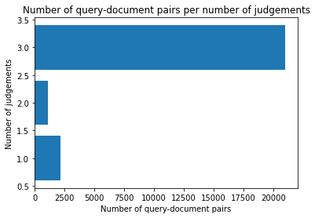

### Majority of queries have 3 documents 

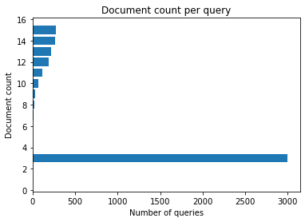

### 69% of pairs have non-unanimous judgements

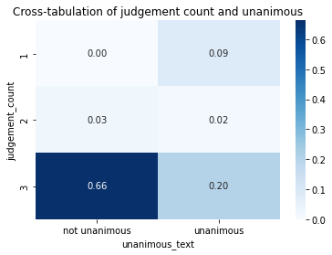

### 43% of pairs are contradictory

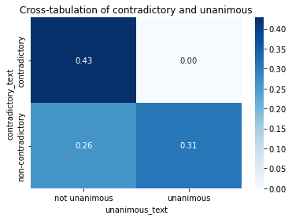

### In 18% of pairs majority was not achieved

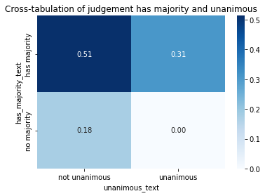

## Hypotheses

While working on judgement aggregation strategies we had several hypotheses about the importance of judgement attributes. 

### Hypothesis: Annotators have different level of trustworthiness
We wanted to quantify the information about level of trustworthiness of each annotator. In order to do that we have investigated the level of agreement between the annotators and we have found that distribution of inter-annotator agreement scores is normally distrubuted. We have used this finding to aggregate judgements based on agreement scores of the annotators. Using this criterion we could solve voting conflicts when all annotators disagree. 

Agreement score distribution for all annotators.

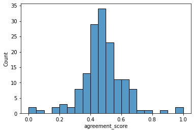

### Hypothesis: Query-document pairs with contractictory judgements require conflict resolution strategy
Some of the pairs contain contradictions between judgements of annotarors, e.g. a pair could have one annotator who voted for relevance class 0 and 2 annotators who voted for relevance class 3. Those contradictory pairs require special attention, because disagreement may indicate that some of the annotators may have provided false judgements.

### Hypothesis: Judgements with provided relevance region are more trustworthy
One of our hypotheses was that those judgements, for which annotators have provided regions for judgements with relevance classes 3 and 4 tend to be more trustworty, because a provided region serves as a proof.

## Judgement aggregation schema

On the diagram below we provide the aggregation schema of the judgements based on defined hypotheses.

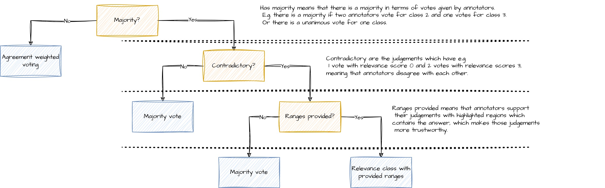

## Comparison with baseline per relevance class

On the heatmap below we assess the differences between custom judgement aggregation approach and provided baseline. In total about 17% of aggregated judgements differ between the baseline and custom aggregation results.

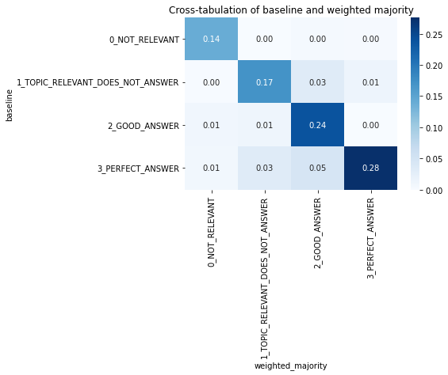

## Analysis of aggregation results

Analysis of the differences based on pairs sampling was performed in the notebook **Part1_Test_collection.ipynb**. Approach for analysis was based on selecting divergence criterion and manual analysis of corresponding pairs, which are different comapared to the baseline. Please refer the notebook for implementation details.

From this analysis we draw the following conclusions: 

Almost all differing pairs compared to baseline are contradictory, comprising 17%. 

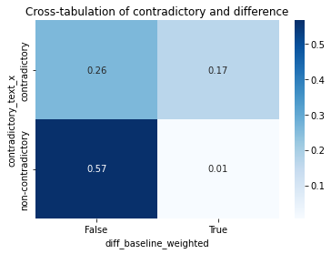

Example of manual analysis of sampled documents:

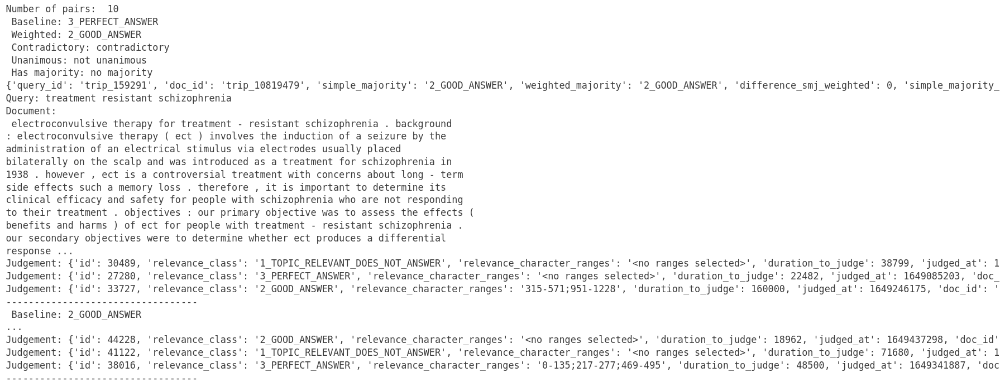

## Conclusions for Part 1

Overall we believe that our custom aggregation schema reflects well our findings from conducted exploratory data analysis. 

# Part 2:

## How to run the code

In the second part of the exercise, we implemented two neural re-ranking models, KNRM and TK, as specified in the provided notebooks **notebooks/Part2_re_ranking_TK.ipynb** and **notebooks/Part2_re_ranking_KNRM.ipynb**. The models were saved and can be found under their name in **models** directory. Implementation of model classes can be found in corresponding paths: KNRM - **src/model_knrm.py** and TK - **src/model_tk.py**. Before running the scripts for in jupyter notebooks, please download the file available under the following location and put it into the **../data/Part-2**: https://drive.google.com/file/d/1tNYTPXmyj5OFAiDOwsm3xITYgrCdUCPi/view?usp=sharing.   

Additionally, aggregated judgements are provided in the file **fira-22.judgements-anonymized-aggregated_v1** These models were trained using provided training data, with the process including early stopping based on the validation set. After training, the models were evaluated on test sets from MS-MARCO and FiRA-2022 datasets, and their performance was compared against baseline methods using predefined metrics and also our own baseline, which was already discussed in **Part 1**. The training process and the evaluation is visible in the above mentioned iypnb files. In the following the resulting metrics are provided.

## TK model implementation notes

For TK model we implemented multihead attention block and did a slight modification compared to the implementation outlined in the paper: https://arxiv.org/abs/2002.01854. Namely we have implemented the hybrid contextualization for each multihead attention layer. Also for model training and inference we have implemented a custom BatchWordEmbedder class to create batches in the correct format.

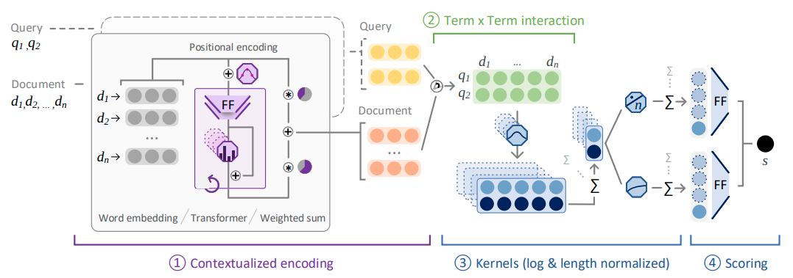

### MS-MARCO results with TK

    TK:
	    - Use the **msmarco_tuples.test.tsv** input to feed the neural models and **msmarco_qrels.txt** qrels to evaluate the output

        {'MRR@10': 0.2317813492063492,
        'Recall@10': 0.4657083333333334,
        'QueriesWithNoRelevant@10': 1050,
        'QueriesWithRelevant@10': 950,
        'AverageRankGoldLabel@10': 3.5652631578947367,
        'MedianRankGoldLabel@10': 3.0,
        'MRR@20': 0.236783314466751,
        'Recall@20': 0.5342916666666666,
        'QueriesWithNoRelevant@20': 910,
        'QueriesWithRelevant@20': 1090,
        'AverageRankGoldLabel@20': 4.963302752293578,
        'MedianRankGoldLabel@20': 3.0,
        'MRR@1000': 0.23825244675891408,
        'Recall@1000': 0.574625,
        'QueriesWithNoRelevant@1000': 830,
        'QueriesWithRelevant@1000': 1170,
        'AverageRankGoldLabel@1000': 6.558119658119658,
        'MedianRankGoldLabel@1000': 4.0,
        'nDCG@3': 0.21571062590580198,
        'nDCG@5': 0.251545146323757,
        'nDCG@10': 0.2858396956732744,
        'nDCG@20': 0.3036647891248599,
        'nDCG@1000': 0.3121836066107091,
        'QueriesRanked': 2000,
        'MAP@1000': 0.23467543810810212}

### FIRA results with TK

        - FiRA-2022 fine-grained labels on out-of-domain data
        - Use your created created labels from part 1
            - Use the **fira-2022.tuples.tsv** input to feed the neural models and your qrels from part 1 to evaluate the output
        - Compare these results with our baseline label

        {'MRR@10': 0.9584031198686371,
        'Recall@10': 0.9514386291048853,
        'QueriesWithNoRelevant@10': 115,
        'QueriesWithRelevant@10': 4060,
        'AverageRankGoldLabel@10': 1.0970443349753694,
        'MedianRankGoldLabel@10': 1.0,
        'MRR@20': 0.9584031198686371,
        'Recall@20': 1.0000527797325827,
        'QueriesWithNoRelevant@20': 115,
        'QueriesWithRelevant@20': 4060,
        'AverageRankGoldLabel@20': 1.0970443349753694,
        'MedianRankGoldLabel@20': 1.0,
        'MRR@1000': 0.9584031198686371,
        'Recall@1000': 1.0000527797325827,
        'QueriesWithNoRelevant@1000': 115,
        'QueriesWithRelevant@1000': 4060,
        'AverageRankGoldLabel@1000': 1.0970443349753694,
        'MedianRankGoldLabel@1000': 1.0,
        'nDCG@3': 0.8754531745450254,
        'nDCG@5': 0.8804138103150848,
        'nDCG@10': 0.9045552653589506,
        'nDCG@20': 0.9177484694976151,
        'nDCG@1000': 0.9177484694976151,
        'QueriesRanked': 4060,
        'MAP@1000': 0.9500647311370559}

         - Use the **fira-2022.tuples.tsv** input to feed the neural models and **fira-2022.baseline-qrels.tsv** qrels to evaluate the output

         {'MRR@10': 0.9506052026916134,
        'Recall@10': 0.9521341793498367,
        'QueriesWithNoRelevant@10': 113,
        'QueriesWithRelevant@10': 4062,
        'AverageRankGoldLabel@10': 1.1164451009354996,
        'MedianRankGoldLabel@10': 1.0,
        'MRR@20': 0.9506052026916134,
        'Recall@20': 1.000052753745516,
        'QueriesWithNoRelevant@20': 113,
        'QueriesWithRelevant@20': 4062,
        'AverageRankGoldLabel@20': 1.1164451009354996,
        'MedianRankGoldLabel@20': 1.0,
        'MRR@1000': 0.9506052026916134,
        'Recall@1000': 1.000052753745516,
        'QueriesWithNoRelevant@1000': 113,
        'QueriesWithRelevant@1000': 4062,
        'AverageRankGoldLabel@1000': 1.1164451009354996,
        'MedianRankGoldLabel@1000': 1.0,
        'nDCG@3': 0.8660275945797691,
        'nDCG@5': 0.873464277441999,
        'nDCG@10': 0.8987960356282988,
        'nDCG@20': 0.9118463607058193,
        'nDCG@1000': 0.9118463607058193,
        'QueriesRanked': 4062,
        'MAP@1000': 0.9398758982965247}

## KNRM model implementation details

For imolementation of KNRM model we were referencing to the original implementation outlined in the paper: https://arxiv.org/pdf/1706.06613. We have implemented all outlined elements of the architecture without any major modifications. We have used a custom BatchWordEmbedder class to overcome the problems with GPU training. 
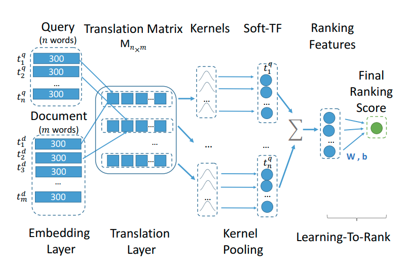

### MS-MARCO results with KRNM

    KNRM:
	    - Use the **msmarco_tuples.test.tsv** input to feed the neural models and **msmarco_qrels.txt** qrels to evaluate the output

        {'MRR@10': 0.1817690476190476,
        'Recall@10': 0.369375,
        'QueriesWithNoRelevant@10': 1245,
        'QueriesWithRelevant@10': 755,
        'AverageRankGoldLabel@10': 3.7072847682119203,
        'MedianRankGoldLabel@10': 3.0,
        'MRR@20': 0.18971659236875957,
        'Recall@20': 0.47979166666666667,
        'QueriesWithNoRelevant@20': 1019,
        'QueriesWithRelevant@20': 981,
        'AverageRankGoldLabel@20': 6.243628950050969,
        'MedianRankGoldLabel@20': 4.0,
        'MRR@1000': 0.19311101499504907,
        'Recall@1000': 0.574625,
        'QueriesWithNoRelevant@1000': 830,
        'QueriesWithRelevant@1000': 1170,
        'AverageRankGoldLabel@1000': 9.876068376068377,
        'MedianRankGoldLabel@1000': 6.0,
        'nDCG@3': 0.16749706819748705,
        'nDCG@5': 0.1919873251456052,
        'nDCG@10': 0.22463290914396003,
        'nDCG@20': 0.2531676692056566,
        'nDCG@1000': 0.272969811529321,
        'QueriesRanked': 2000,
        'MAP@1000': 0.18992419478055275}

### FIRA results with KNRM

        - FiRA-2022 fine-grained labels on out-of-domain data
        - Use your created created labels from part 1
            - Use the **fira-2022.tuples.tsv** input to feed the neural models and your qrels from part 1 to evaluate the output
        - Compare these results with our baseline label

        {'MRR@10': 0.9560344827586207,
        'Recall@10': 0.9508765283703707,
        'QueriesWithNoRelevant@10': 115,
        'QueriesWithRelevant@10': 4060,
        'AverageRankGoldLabel@10': 1.1029556650246306,
        'MedianRankGoldLabel@10': 1.0,
        'MRR@20': 0.9560344827586207,
        'Recall@20': 1.0000527797325827,
        'QueriesWithNoRelevant@20': 115,
        'QueriesWithRelevant@20': 4060,
        'AverageRankGoldLabel@20': 1.1029556650246306,
        'MedianRankGoldLabel@20': 1.0,
        'MRR@1000': 0.9560344827586207,
        'Recall@1000': 1.0000527797325827,
        'QueriesWithNoRelevant@1000': 115,
        'QueriesWithRelevant@1000': 4060,
        'AverageRankGoldLabel@1000': 1.1029556650246306,
        'MedianRankGoldLabel@1000': 1.0,
        'nDCG@3': 0.870678805114396,
        'nDCG@5': 0.8755932545053234,
        'nDCG@10': 0.9001940416552495,
        'nDCG@20': 0.9139540272527631,
        'nDCG@1000': 0.9139540272527631,
        'QueriesRanked': 4060,
        'MAP@1000': 0.9468693220351503}

         - Use the **fira-2022.tuples.tsv** input to feed the neural models and **fira-2022.baseline-qrels.tsv** qrels to evaluate the output

         {'MRR@10': 0.9477214289621971,
        'Recall@10': 0.9517564585696048,
        'QueriesWithNoRelevant@10': 113,
        'QueriesWithRelevant@10': 4062,
        'AverageRankGoldLabel@10': 1.1233382570162482,
        'MedianRankGoldLabel@10': 1.0,
        'MRR@20': 0.9477214289621971,
        'Recall@20': 1.000052753745516,
        'QueriesWithNoRelevant@20': 113,
        'QueriesWithRelevant@20': 4062,
        'AverageRankGoldLabel@20': 1.1233382570162482,
        'MedianRankGoldLabel@20': 1.0,
        'MRR@1000': 0.9477214289621971,
        'Recall@1000': 1.000052753745516,
        'QueriesWithNoRelevant@1000': 113,
        'QueriesWithRelevant@1000': 4062,
        'AverageRankGoldLabel@1000': 1.1233382570162482,
        'MedianRankGoldLabel@1000': 1.0,
        'nDCG@3': 0.8614270150469169,
        'nDCG@5': 0.8688532389398897,
        'nDCG@10': 0.8945172252825958,
        'nDCG@20': 0.9077459409980746,
        'nDCG@1000': 0.9077459409980746,
        'QueriesRanked': 4062,
        'MAP@1000': 0.9362002840850584}

## Conclusions for Part 2

Out of all these measures a few observations can be made. First of all, in general the metrics like MRR@10 tend to have better results for the TK model than for the KNRM model. A possible explanation might be that the KNRM model doesn't make use of attention mechanisms while TK does, resulting in superior performance. Furthermore, the metrics using the FiRA dataset tend to be higher. This can be seen as a consquence of the FiRA being bigger and also containing more judgements. Finally, the use of our own baseline provided slightly worse result in terms of the metrics for example the MRR@10 (for MRR@10 the deviation was normally smaller than 1%) compared to the provided FiRA baseline. Similar results can be observed for other popular metrics like NDCG@10 or Recall@10.

## Remarks for Part 2

It was really diffilcut to run the code. None of us had a powerful enough machine to train the models appropriately. Also on Colab it was very hard without using the Pro version, to run the code as a notebook. Therefore finally SageMaker Studio Lab was used. Also installing the environment locally on Windows didn't work for us, so we changed to Ubunut. After installing the environment on SageMaker Studio Lab, we could make it run. However, the set up really took a lot of time and effort.

# Part: 3

## How to run the code
The code needed for part three is implemented in src/extractive_qa.py. It was executed in Google Colab using the file notebooks/part3_extractive_qa.ipynb. To ensure the script functions correctly, you need to organize your files within the `data` directory. Place the `msmarco-fira-21.qrels.qa-tuples.tsv` and `msmarco-fira-21.qrels.qa-answers.tsv` files in the `data/Part-3/` folder. The reranked file, `tk_msmarco_ranking_final.tsv`, should be found in the `data/results_part2/` directory. The outputs of part 3 will be stored in the `data/results_part3/` folder. Using the arguments -t, -a and -r allows for the use of alternative paths. Please refer to the source code (extractive.py) for a closer description.

## Re-ranking model

In this part of the exercise, we focus on implementing a neural network re-ranking model to improve retrieval performance. The task involves running extractive question-answering (QA) using a pre-trained model from HuggingFace and analyzing its behavior on the top-1 neural re-ranking result of the MSMARCO FIRA set as well as on the gold-label pairs of MSMARCO-FiRA-2021. For the top-1 neural re-ranking results, we used the re-ranking resulting from the TK model.

## Pre-trained model from huggingface

For the pre-trained model, we decided to run the roberta-base-squad2 model (https://huggingface.co/deepset/roberta-base-squad2) by deepset. At the time of the choice, roberta-base-squad2 was the most liked and most downloaded model when filtering for QA models. Furthermore, deepset, the team behind the model, has a solid track record with projects like Haystack and German BERT, among others. The downloaded model uses a RoBERTa-base fine-tuned using the SQuAD2.0 dataset. The fine-tuning was done by training on question-answer pairs (including unanswerable questions). RoBERTa is a robustly optimized BERT approach implemented by Meta (Facebook). The model is pre-trained on the English language using a masked language modeling (MLM) approach.

## Experiment
First, we extracted the top-ranked documents from the re-ranking result of the TK approach on the validation set from part 2 of the assignment. The resulting dataset was then merged with the provided msmarco-fira-21.qrels.qa-answers.tsv to extract the overlapping query-document pairings. We then set up the model pipeline using the deepset/roberta-base-squad2 described above.

We ran the model on both the overlapping Top-1 ranked results as well as the msmarco-fira-21.qrels.qa-tuples.tsv. The model was run on Google Colab's T4 GPU.

Finally, we evaluated the models using the core metrics:
   - F1: Measures the overlap between the predicted and ground truth answers.
   - Exact Match: Measures the exact match between the predicted and ground truth answers.

The table below shows the results:

| **Dataset** | **Items** | **F1** | **Exact Match** |
| :-------: | :--------: | :---------: | :--------: |
| **FIRA-21-tuples**  |    52606    |    0.416     |    0.131    |
|  **Top-1-reranked**   |   831    |   0.445    |   0.177   | 

These results indicate that the model performs better on the Top-1 re-ranked dataset compared to the provided Fira dataset, as evidenced by the higher F1 and Exact Match scores.

## Discussion

The results suggest that the pre-trained extractive QA model is effective in improving the retrieval performance, particularly for the re-ranked dataset. The F1 scores indicate a significant overlap between the predicted and actual answers, while the Exact Match scores show a reasonable level of exactness in the predictions.

# Work distribution and collaboration
Our group had a great time working together. We consider, that we did a good job and distributed the workload well. To give more information about involvement of each group member below we provide an outline of the individual contributions:

* 12238682 - Vladimir Panin
    * Part 1: Participated in discussions, Proposed stochastic aggregation method, which later was discarded and instead another one was chosen
    * Part 2: Participated in discussions, implemented training procedure on sagemaker,  conducted experiments with model training, obtained final model results, wrote report.
    * Part 3: -

* 11803058 - Sakka Mahmoud Abdussalem 
    * Part 1: Participated in discussions.
    * Part 2: Loaded required datasets from Part 2.
    * Part 3: Extraction of the Top-1 results, research and choice of the qa model used, implementation of the pre-trained model and evaluation of the results, wrote report.

* 12202120 - Grebnev Roman
    * Part 1: Participated in discussions, conducted exploratory data analysis, suggested hypotheses, suggested aggregation based on inter annotators agreement, implemented custom judgement aggregation schema, wrote report.
    * Part 2: Participated in discussions, reproduced model classes for KNRM and TK from provided papers, conducted initial experiments with model training, wrote report.
    * Part 3: -
